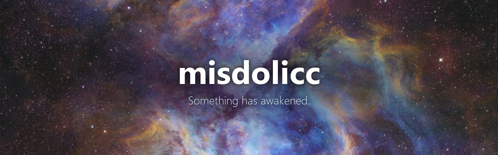
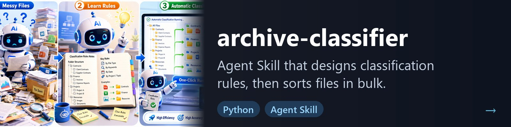
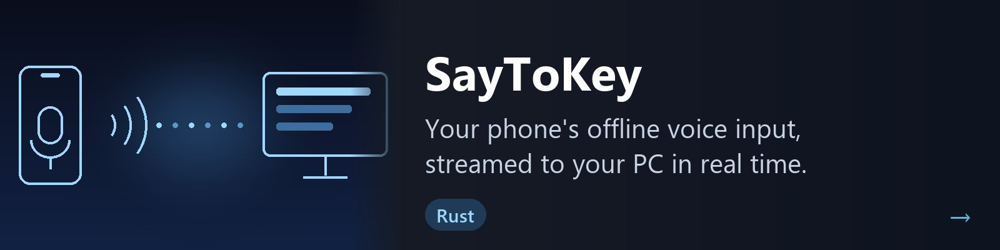
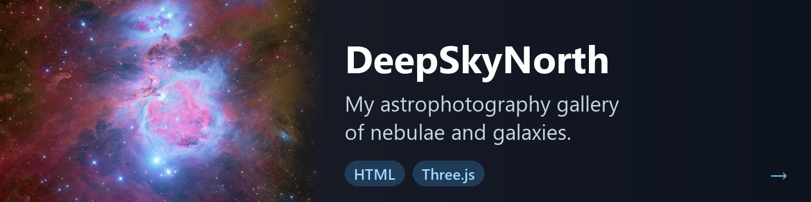

  

---

### Tech stack

  
  
  
  
  
  
  

### Featured projects

  
  
  
  

### GitHub stats

  
   
  

  <picture>
    <source media="(prefers-color-scheme: dark)" srcset="https://raw.githubusercontent.com/misdolicc/misdolicc/output/snake-dark.svg" />
    
  </picture>

